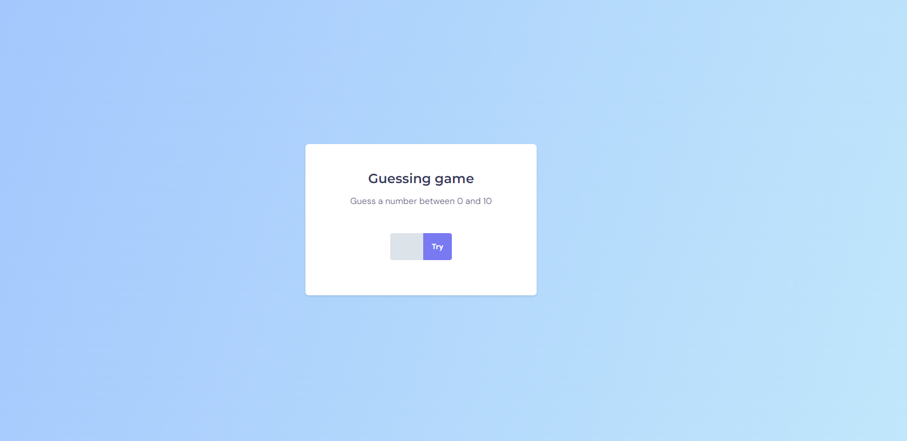

# GuessingGame
A guessing game, done using HTML/CSS and Javascript

This project has a guessing game, where you can input numbers from 0 to 10. After that, the game will analyze if it was the number it generated. After you inser the correct number, it will say in how many attempts you got it right.

Available at: [https://guessing-game-ten.vercel.app](https://guessing-game-ten.vercel.app/)

